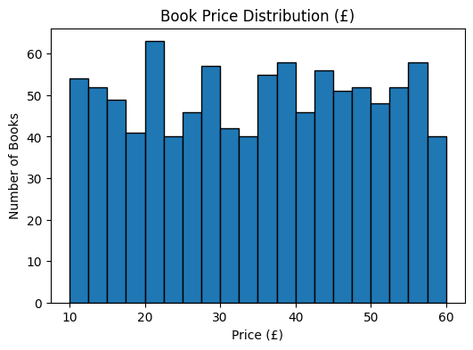
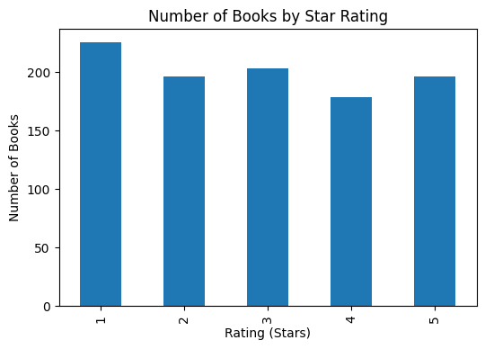

# 📚 Books to Scrape — Web Scraping & Analysis

This is an **end-to-end data project** where I scraped book data from [Books to Scrape](http://books.toscrape.com/), cleaned it, and performed exploratory data analysis with Python.

---

## 🔹 Tech Stack

* **Python**
* `requests`, `BeautifulSoup` (for scraping)
* `pandas` (for data cleaning & manipulation)
* `matplotlib` (for visualization)

---

## 🔹 Project Workflow

1. **Scraping**

   * Collected 1,000 books across 50 pages.
   * Extracted: `Title`, `Price (£)`, `Availability`, `Rating`, `Link`.

2. **Cleaning**

   * Converted `Price` → numeric (float).
   * Parsed `Availability` into `InStock` (1/0).
   * Mapped `Rating` from words (`"Three"`) → numbers (`3`).

3. **Exploratory Data Analysis (EDA)**

   * Average, median, min, and max prices.
   * Count of books by rating (1–5 stars).

4. **Visualization**

   * Histogram of book prices.


   * Bar chart of book ratings.


---

## 🔹 Key Insights

* 📊 **Average book price:** £35.07
* 📊 **Median price:** £35.98
* 💰 **Most expensive book:** £59.99
* 💰 **Cheapest book:** £10.00
* ⭐ Ratings distribution:

  * 1 star → 226 books
  * 2 stars → 196 books
  * 3 stars → 203 books
  * 4 stars → 179 books
  * 5 stars → 196 books

---

## 🔹 Sample Visualizations

Price distribution:


Book ratings:


---

## 🚀 How to Run

1. Clone the repo:

   ```bash
   git clone https://github.com/yourusername/books-scraper.git
   cd books-scraper
   ```
2. Install dependencies:

   ```bash
   pip install -r requirements.txt
   ```
3. Run the notebook:

   ```bash
   jupyter notebook books_scraper.ipynb
   ```

---

## 🔹 Dataset

The data comes from [Books to Scrape](http://books.toscrape.com/), a website designed specifically for practicing web scraping.

---

👌 This project demonstrates skills in **web scraping, data cleaning, exploratory analysis, and visualization**.
